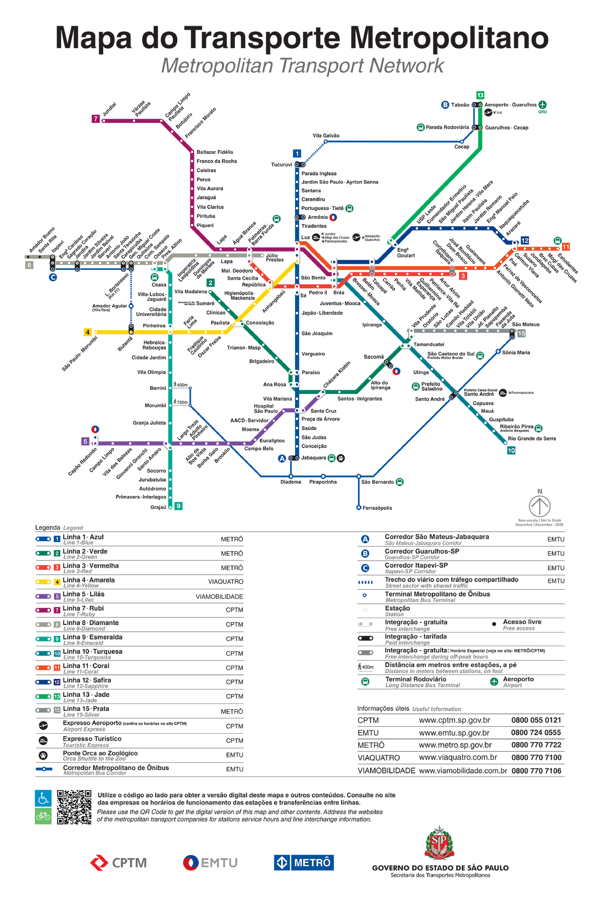
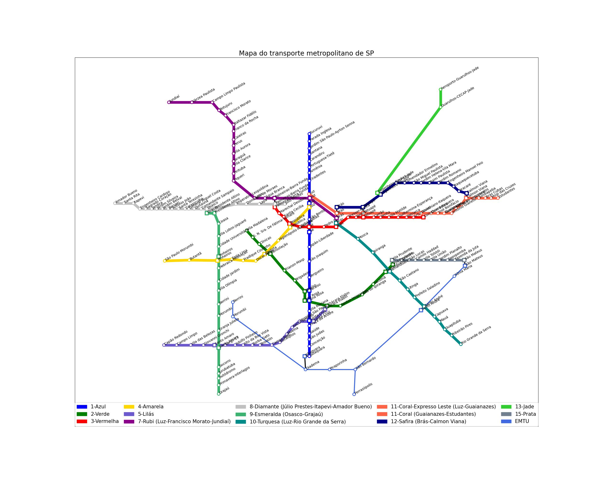

# Grafo da Rede de transporte metropolitano de SP

Projeto para o Curso de Data Science (2023) / Ada (Let's Code), desenvolvido em Python 3.9.7, utilizando as bibliotecas:

- networkx
- matplotlib
- pandas
- numpy

O projeto consistiu em modelar a __rede de transporte metropolitano de SP__ como um grafo, tendo como base a [imagem](http://www.metro.sp.gov.br/pdf/mapa-da-rede-metro.pdf) a seguir:

A modelagem foi feita com base em um arquivo csv fornecido em aula. Porém, para estruturar os dados, precisei ajustá-lo adicionando as seguintes colunas:

- __id:__ para indicar a ordem das estações. Números adjacentes indicam estações adjacentes pertencentes à mesma linha.
- __baldeacao:__ contém o id de cada estação com a qual o registro faz baldeação. Cada id está separado por espaço.
- __pos_x:__ valor para posicionar no eixo x do grafo o nó representante da estação
- __pos_y:__ valor para posicionar no eixo y do grafo o nó representante da estação

_Obs.: As posições x e y definidas nas estações são meramente para fins de ilustração do grafo._
Esses valores foram obtidos com base na imagem acima, por meio da biblioteca OpenCV, seguindo o tutorial [deste link](https://www.geeksforgeeks.org/displaying-the-coordinates-of-the-points-clicked-on-the-image-using-python-opencv/).

__Arquivo ajustado para a modelagem: [sp_transporte_ajustado.csv](sp_transporte_ajustado.csv)__

### Features do projeto:
- Construção do grafo com a rede de transporte metropolitano de SP
- Função que lista todas as estações/nós do grafo
- Função que recebe como argumento duas estações (origem e destino) e retorna o melhor caminho entre elas, explicando passo a passo qual é a rota que o usuário deve seguir
- Função que constrói a visualização do grafo

#### Resultado do grafo modelado:
